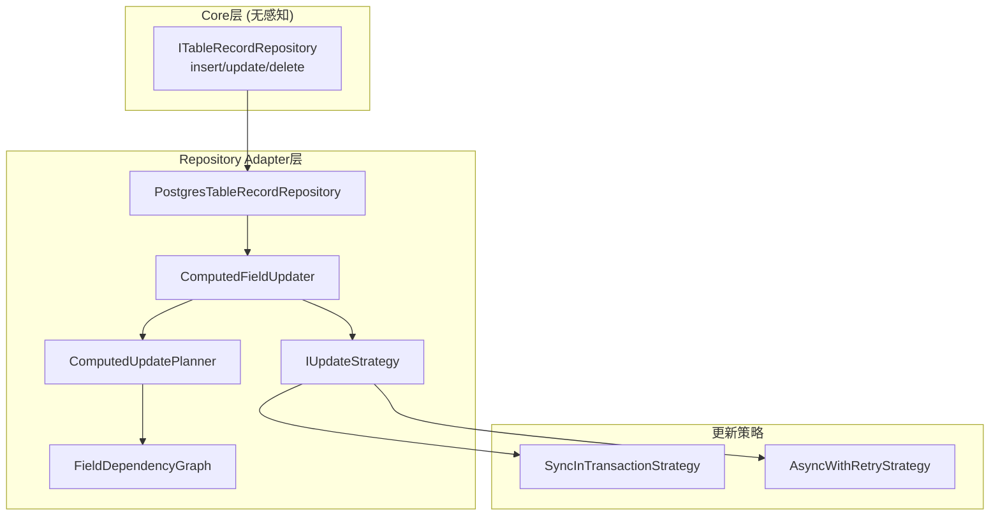
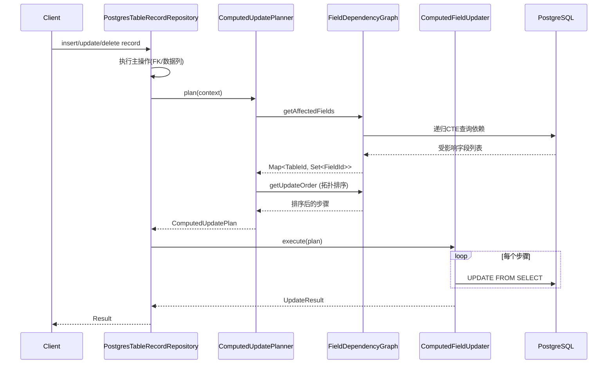

# 计算字段级联更新方案

## 1. 架构概览




## 2. 核心组件设计

### 2.1 字段依赖图 (FieldDependencyGraph)

位置: `packages/v2/adapter-record-repository-postgres/src/computed/FieldDependencyGraph.ts`

```typescript
interface FieldReference {
  fromFieldId: FieldId;
  fromTableId: TableId;
  toFieldId: FieldId;
  toTableId: TableId;
}

interface IFieldDependencyGraph {
  // 从改变的字段找到所有受影响的字段（跨表）
  getAffectedFields(
    changedFields: Array<{ tableId: TableId; fieldId: FieldId }>
  ): Result<Map<TableId, Set<FieldId>>, DomainError>;
  
  // 获取拓扑排序后的更新顺序（列级别）
  getUpdateOrder(
    affectedFields: Map<TableId, Set<FieldId>>
  ): Result<Array<{ tableId: TableId; fieldId: FieldId }>, DomainError>;
}
```

关键：使用 **递归CTE** 在数据库层面完成依赖遍历，避免在JS层读取大量数据。

#### 2.1.1 依赖来源与缺失补偿（legacy 兼容）

- 优先使用 `reference` 表（`from_field_id -> to_field_id`）构建跨表依赖。
- 如果发现 link/lookup/rollup 在 `reference` 中缺失，使用字段配置补齐依赖边：
  - `LinkFieldConfig` → `linkFieldId -> linkField`（link stored 依赖 lookup/title）
  - `LookupOptions` → `linkFieldId` + `lookupFieldId` 生成依赖边
  - `RollupFieldConfig` → `linkFieldId` + `lookupFieldId`
- 补齐逻辑只在 adapter 内部进行，不修改 core 规则。

### 2.2 更新计划器 (ComputedUpdatePlanner)

位置: `packages/v2/adapter-record-repository-postgres/src/computed/ComputedUpdatePlanner.ts`

```typescript
interface UpdateStep {
  tableId: TableId;
  fieldIds: FieldId[];           // 可以batch更新同表的多个字段
  recordFilter?: RecordFilter;   // 精确限制受影响的记录
}

interface ComputedUpdatePlan {
  steps: UpdateStep[];
  estimatedComplexity: number;   // 用于运行时策略选择
}

interface IComputedUpdatePlanner {
  plan(
    context: UpdateContext
  ): Promise<Result<ComputedUpdatePlan, DomainError>>;
}

interface UpdateContext {
  changedTableId: TableId;
  changedFieldIds: FieldId[];
  changedRecordIds: RecordId[];
  changeType: 'insert' | 'update' | 'delete';
}
```

#### 2.2.1 公式排序规则

- 表内公式：只按 **同表依赖** 排序（公式可引用同表字段）。
- 跨表影响：依赖图上存在 link/lookup/rollup 边时，允许 **跨表级联顺序**，同一表可能被多次调度（A → B → A）。


### 2.3 更新执行器 (ComputedFieldUpdater)

位置: `packages/v2/adapter-record-repository-postgres/src/computed/ComputedFieldUpdater.ts`

```typescript
interface IComputedFieldUpdater {
  execute(
    plan: ComputedUpdatePlan,
    context: IExecutionContext
  ): Promise<Result<UpdateResult, DomainError>>;
}

// 生成 UPDATE FROM SELECT 的 SQL
// 复用 ComputedFieldSelectExpressionVisitor 生成 SELECT 部分
```


### 2.4 更新策略 (IUpdateStrategy)

位置: `packages/v2/adapter-record-repository-postgres/src/computed/strategies/`

```typescript
interface IUpdateStrategy {
  readonly name: string;
  execute(
    updater: IComputedFieldUpdater,
    plan: ComputedUpdatePlan,
    context: IExecutionContext
  ): Promise<Result<void, DomainError>>;
}

// 同步策略：在当前事务内执行
class SyncInTransactionStrategy implements IUpdateStrategy { }

// 异步策略：事务提交后异步执行，带重试
class AsyncWithRetryStrategy implements IUpdateStrategy {
  // 使用消息队列或事件驱动
  // 失败时记录到重试表
  // 支持补偿（定期全量重算）
}
```


## 3. 数据流与执行顺序




## 4. 精确更新的实现

### 4.1 记录级别的影响追踪

```sql
-- 当 Table A 的 record R1 的 Link 字段变更时
-- 找到受影响的 Table B 的 Lookup 字段需要更新哪些记录

WITH changed_links AS (
  -- R1 通过 Link 关联到的外表记录
  SELECT foreign_record_id FROM junction_table WHERE self_record_id = 'R1'
),
affected_records AS (
  -- 反向查找：哪些记录的 Lookup 引用了这些外表记录
  SELECT t.__id 
  FROM table_b t
  WHERE t.__fk_link_field IN (SELECT foreign_record_id FROM changed_links)
)
UPDATE table_b SET ...
FROM (SELECT computed_fields FROM ... WHERE __id IN (SELECT * FROM affected_records)) sub
WHERE table_b.__id = sub.__id;
```


### 4.2 Link stored 值的更新

Link 字段有两部分：

1. **FK列** (`__fk_xxx`) - source of truth，直接写入
2. **Stored列** (jsonb格式，包含 id+title) - 计算得出

更新流程：

1. 写入FK值（或junction表）
2. 使用 `ComputedFieldSelectExpressionVisitor` 的 `visitLinkField` 生成SELECT
3. 执行 UPDATE FROM SELECT 更新stored列

补充规则：

- link stored **双向更新**（对称 link 字段同时更新）。
- 如果存在 order 列，`json_agg/array_agg` 必须带 `ORDER BY order_column`；没有 order 列则不保证顺序。

## 5. 同步/异步策略切换

### 5.1 系统层面配置

```typescript
// 在容器注册时配置默认策略
container.register(v2ComputedTokens.defaultStrategy, {
  useValue: 'sync' // 或 'async'
});
```


### 5.2 运行时动态选择

```typescript
// 根据复杂度自动选择
const strategy = plan.estimatedComplexity > THRESHOLD
  ? container.resolve(AsyncWithRetryStrategy)
  : container.resolve(SyncInTransactionStrategy);
```


### 5.3 异步模式的错误处理

```typescript
interface ComputedUpdateJob {
  id: string;
  plan: ComputedUpdatePlan;
  retryCount: number;
  maxRetries: number;
  createdAt: Date;
  lastError?: string;
}

// 事件处理器式异步（类似 realtime projection）：
// - 主事务只写 source-of-truth，事件触发异步更新
// - 错误严格记录（job 状态 + lastError）
// - 指数退避重试；最终一致性可通过定期全量重算补偿
```


## 6. 测试策略

### 6.1 SQL Snapshot 测试

位置: `packages/v2/adapter-record-repository-postgres/src/computed/__tests__/`

```typescript
describe('ComputedFieldUpdater', () => {
  it('generates correct UPDATE SQL for formula field', () => {
    const plan = planner.plan({ /* context */ });
    const sqls = updater.buildUpdateStatements(plan);
    
    // Snapshot 包含：
    // 1. 更新计划步骤
    // 2. 每步生成的SQL
    // 3. 执行顺序
    expect(sqls).toMatchSnapshot();
  });
  
  it('generates correct SQL for cross-table lookup cascade', () => {
    // 测试跨表级联
  });
});
```


### 6.2 E2E 测试

位置: `packages/v2/e2e/src/computed-update.e2e.spec.ts`

```typescript
describe('computed field cascade update', () => {
  it('updates lookup when link changes', async () => {
    // 1. 创建带 Link+Lookup 的表结构
    // 2. 插入记录
    // 3. 修改 Link 字段
    // 4. 验证 Lookup 值自动更新
  });
  
  it('handles multi-level lookup cascade', async () => {
    // Table A -> Link -> Table B -> Lookup -> Table C
    // 修改 Table A 的记录，验证 Table C 的 Lookup 更新
  });
});
```


### 6.3 性能测试

```typescript
describe('computed update performance', () => {
  it.skip('handles 10k records update efficiently', async () => {
    // 使用 benchmark 工具
    // 记录执行时间和内存使用
  });
});
```


## 7. 文件结构

```javascript
packages/v2/adapter-record-repository-postgres/src/
├── computed/
│   ├── ARCHITECTURE.md
│   ├── index.ts
│   ├── FieldDependencyGraph.ts
│   ├── ComputedUpdatePlanner.ts
│   ├── ComputedFieldUpdater.ts
│   ├── UpdateFromSelectBuilder.ts      # 构建 UPDATE FROM SELECT
│   ├── strategies/
│   │   ├── IUpdateStrategy.ts
│   │   ├── SyncInTransactionStrategy.ts
│   │   └── AsyncWithRetryStrategy.ts
│   └── __tests__/
│       ├── ComputedFieldUpdater.spec.ts
│       └── __snapshots__/
├── query-builder/
│   └── computed/
│       └── ComputedFieldSelectExpressionVisitor.ts  # 复用现有
└── repository/
    └── PostgresTableRecordRepository.ts  # 集成computed更新


```