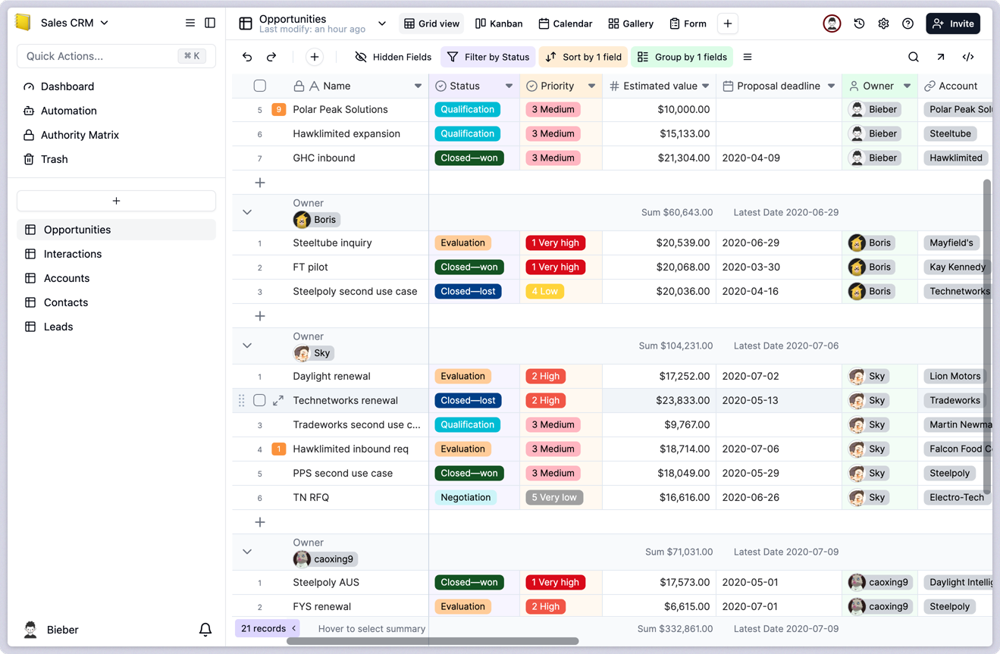
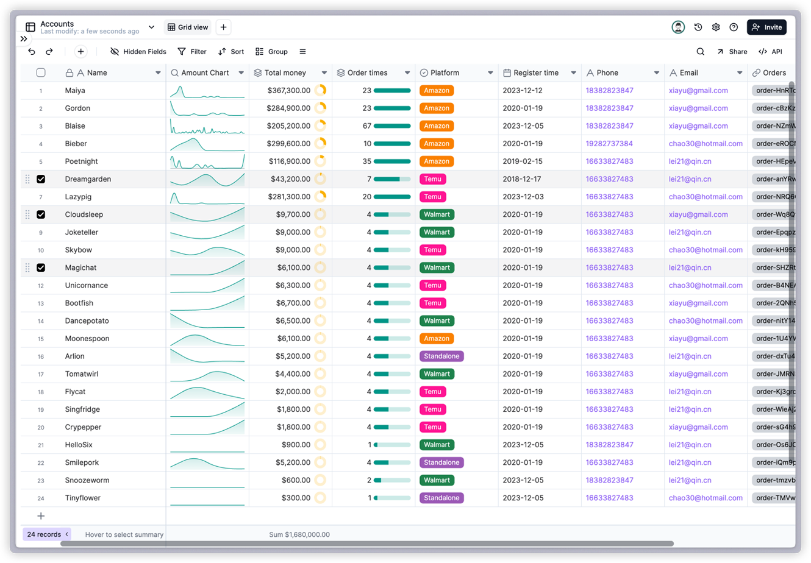
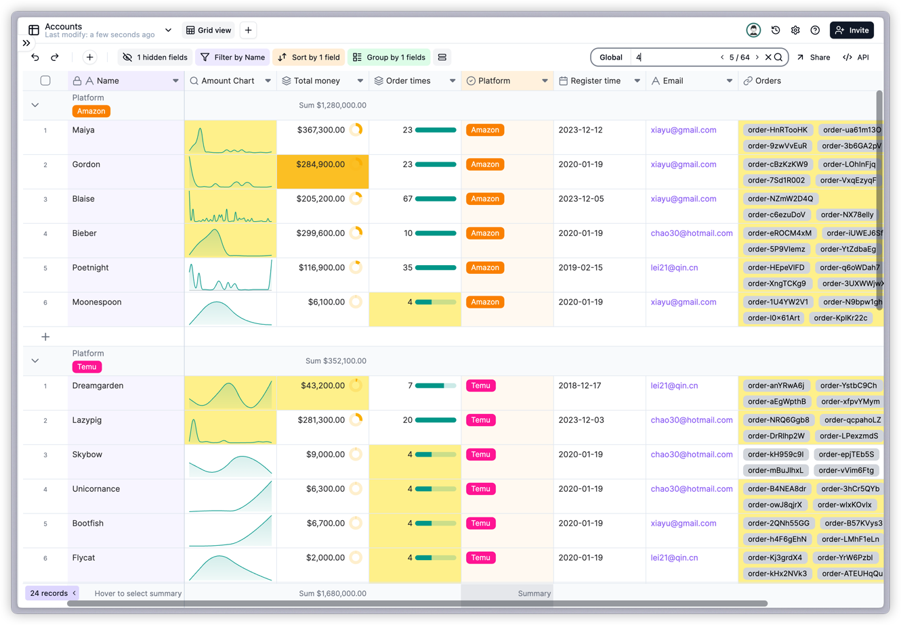
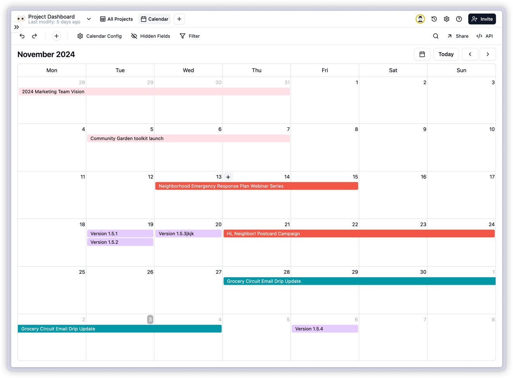
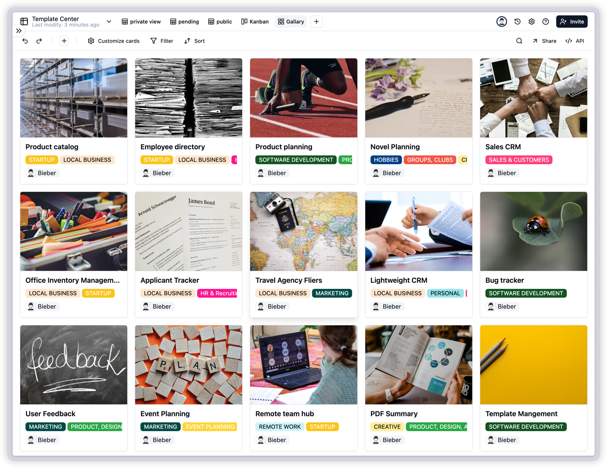
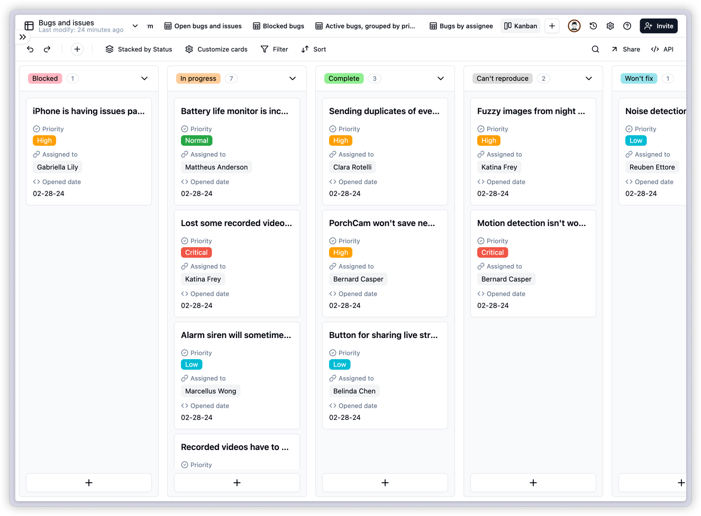
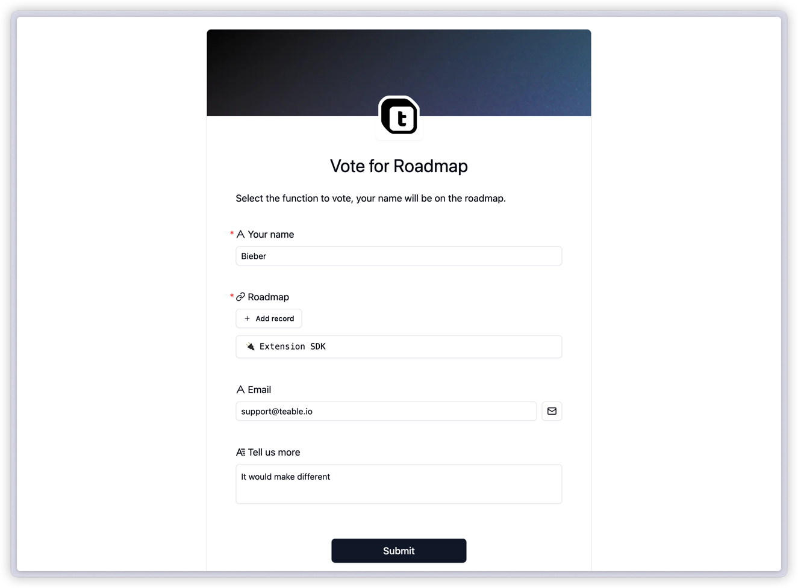
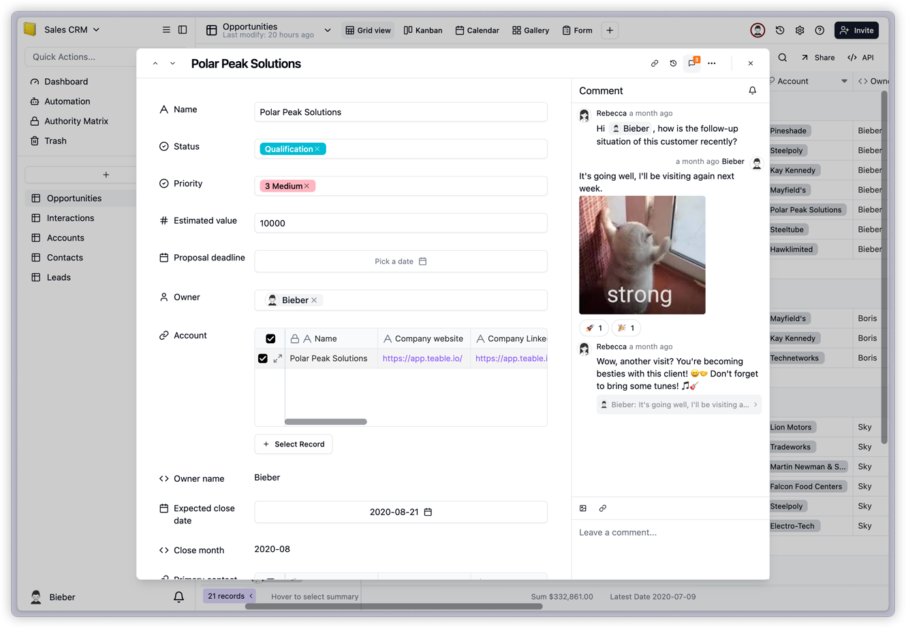
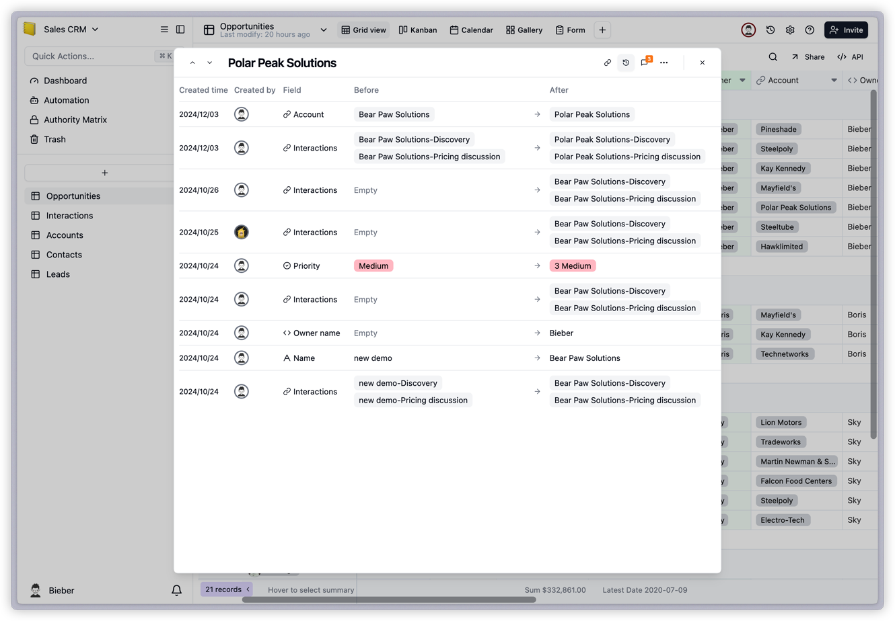
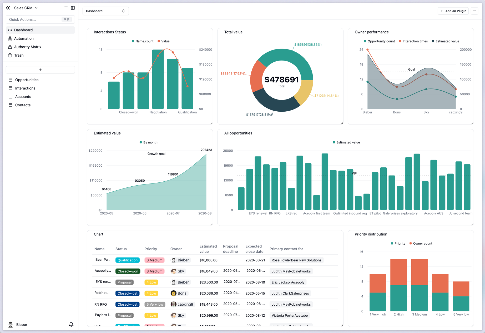

<div align="center">
  <h1 align="center">
    <picture>
      <source media="(prefers-color-scheme: dark)" srcset="static/assets/images/teable-vertical-dark.png">
      
    </picture>
  </h1>
  <h3 align="center"><strong>The Fastest Spreadsheet Database for Teams</strong></h3>
  <p>Teable uses a simple, spreadsheet-like interface to create powerful database applications. Collaborate with your team in real-time, and scale to millions of rows.</p>
  <p>Try out Teable using our hosted version at <a href="https://teable.io">teable.io</a>.</p>
</div>

<div align="center">
<a href="https://trendshift.io/repositories/8516" target="_blank"></a>
</div>

<p align="center">
  <a target="_blank" href="https://teable.io">Home</a> | <a target="_blank" href="https://help.teable.io">Help</a> | <a target="_blank" href="https://Blog.teable.io">Blog</a> | <a target="_blank" href="https://template.teable.io">Template</a> | <a target="_blank" href="https://help.teable.io/developer/api">API</a> | <a target="_blank" href="https://app.teable.io/share/shr04TEw1u9EOQojPmG/view">Roadmap</a> | <a target="_blank" href="https://discord.gg/uZwp7tDE5W">Discord</a> | <a target="_blank" href="https://twitter.com/teableio">Twitter</a>
</p>

<p align="center">
  <a aria-label="Build" href="https://github.com/teableio/teable/actions?query=Build%20and%20Push%20to%20Docker%20Registry">
    
  </a>
  <a aria-label="Codefactor grade" href="https://www.codefactor.io/repository/github/teableio/teable">
    
  </a>
  <a aria-label="Coverage Status" href="https://coveralls.io/github/teableio/teable?branch=develop">
    
  </a>
  <a aria-label="CodeClimate technical debt" href="https://codeclimate.com/github/teableio/teable">
    
  </a>
  <a aria-label="Codacy grade" href="https://www.codacy.com/gh/teableio/teable/dashboard?utm_source=github.com&amp;utm_medium=referral&amp;utm_content=teableio/teable&amp;utm_campaign=Badge_Grade">
    
  </a>
  <a aria-label="Top language" href="https://github.com/teableio/teable/search?l=typescript">
    
  </a>
</p>
  <h1 align="center">
    <picture>
      <source media="(prefers-color-scheme: dark)" srcset="static/assets/images/teable-interface-dark.png">
      
    </picture>
  </h1>

## Quick Guide

1. Looking for a quick experience? Select a scenario from the [template center](https://template.teable.io) and click "Use this template".
2. Seeking high performance? Try the [1 million rows demo](https://app.teable.io/share/shrVgdLiOvNQABtW0yX/view) to feel the speed of Teable.
3. Want to learn to use it quickly? Click on this [tutorial](https://help.teable.io/quick-start/build-a-simple-base)
4. Interested in deploying it yourself? Click [Deploy on Railway](https://railway.app/template/wada5e?referralCode=rE4BjB)

## ✨Features

#### 📊 Spreadsheet-like Interface

Database is never easier like this

- [x] Aggregation Function
- [x] Attachments preview
- [x] Batch Cell Editing
- [x] Charts
- [x] Comments
- [x] Custom Columns
- [x] Data Formatting
- [x] Data Sorting and Filtering
- [x] Data Validation
- [x] Formula Support
- [x] Grouping
- [x] Import/Export
- [x] Search
- [x] Undo/Redo
- [x] Real-time

#### 🗂️ Multiple Views

Visualize and interact with data in various ways best suited for their specific tasks.

- Grid View
- Form View
- Kanban View
- Gallery View
- Calendar View

<table align="center" style="width: 100%;">
  <tr>
    <td width="50%"></td>
    <td width="50%"></td>
  </tr>
  <tr>
    <td width="50%"></td>
    <td width="50%"></td>
  </tr>
  <tr>
    <td width="50%"></td>
    <td width="50%"></td>
  </tr>
  <tr>
    <td width="50%"></td>
    <td width="50%"></td>
  </tr>
</table>

#### 📊 Charts & Dashboard

  


#### 🚀 Super Fast

Amazing response speed and data capacity

- Millions of data are easily processed, and there is no pressure to filter and sort
- Automatic database indexing for maximum speed
- Supports batch data operations at one time

#### 👨‍💻 Full-featured SQL Support

Seamless integration with the software you are familiar with

- BI tools like Metabase PowerBi...
- No-code tools like Appsmith...
- Direct retrieve data with native SQL

#### 🔒 Privacy-First

You own your data, in spite of the cloud

- Bring your own database (coming soon)

#### ⚡️ Real-time Collaboration

Designed for teams

- No need to refresh the page, data is updated in real-time
- Seamlessly integrate collaboration member invitation and management
- Perfect permission management mechanism, from table to column level

#### 🧩 Extensions

Expand infinite possibilities

- Backend-less programming capability based on React
- Customize your own application with extremely low cost
- Extremely easy-to-use script extensions mode

---

# Structure

[](https://gitpod.io/#https://github.com/teableio/teable)

```
.
├── apps (AGPL 3.0) 
│   ├── nextjs-app          (front-end)
│   └── nestjs-backend      (backend)
├── packages (MIT)
│   ├── common-i18n         (locales)
│   ├── core                (share code and interface)
│   ├── sdk                 (sdk for extensions)
│   ├── db-main-prisma      (schema, migrations, prisma client)
│   ├── eslint-config-bases (to shared eslint configs)
│   └── ui-lib              (ui component)
└── plugins (AGPL 3.0)      (custom plugins)

```

## Deploy

### Deploy With Docker

```sh
cd dockers/examples/standalone/
docker-compose up -d
```

for more details, see [install teable](https://help.teable.io/deployment/docker-compose)

### One Click Deployment

These platforms are easy to deploy with one click and come with free credits.

[](https://railway.app/template/wada5e?referralCode=rE4BjB)

[](https://zeabur.com/templates/QF8695)

[](https://cloud.sealos.io/?openapp=system-template%3FtemplateName%3Dteable)

[](https://repocloud.io/details/?app_id=273)

[](https://elest.io/open-source/teable)

## Development

#### 1. Initialize

```sh
# Enabling the Help Management Package Manager
corepack enable

# Install project dependencies
pnpm install
```

#### 2. Select Database

we currently support `sqlite` (dev only) and `postgres`, you can switch between them by running the following command

```sh
make switch-db-mode
```

#### 3. Custom Environment Variables（Optional）

```sh
cd apps/nextjs-app
copy .env.development .env.development.local
```

#### 4. Run Dev Server

you just need to start backend, it will start next server for frontend automatically, file change will be auto reload

```sh
cd apps/nestjs-backend
pnpm dev
```

## Why Teable?

No-code tools have significantly speed up how we get things done, allowing non-tech users to build amazing apps and changing the way many work and live. People like using spreadsheet-like UI to handle their data because it's easy, flexible, and great for team collaboration. They also prefer designing their app screens without being stuck with clunky templates.

Giving non-techy people the ability to create their software sounds exciting. But that's just the start:

- As businesses expand, their data needs intensify. No one wishes to hear that once their orders reach 100k, they'll outgrow their current interface. Yet, many no-code platforms falter at such scales.
- Most no-code platforms are cloud-based. This means your important data sits with the provider, and switching to another platform can be a headache.
- Sometimes, no-code tools can't do what you want because of their limitations, leaving users stuck.
- If a tool becomes essential, you'll eventually need some tech expertise. But developers often find these platforms tricky.
- Maintaining systems with complex setups can be hard for developers, especially if these aren't built using common software standards.
- Systems that don't use these standards might need revamping or replacing, costing more in the long run. It might even mean ditching the no-code route and going back to traditional coding.

#### What We Think the Future Of No-code Products Look Like

- An interface that anyone can use to build applications easily.
- Easy access to data, letting users grab, move, and reuse their information as they wish.
- Data privacy and choice, whether that's in the cloud, on-premise, or even just on your local.
- It needs to work for developers too, not just non-tech users.
- It should handle lots of data, so it can grow with your business.
- Flexibility to integrate with other software, combining strengths to get the job done.
- Last, native AI integration to takes usability to the next level.

In essence, Teable isn't just another no-code solution, it's a comprehensive answer to the evolving demands of modern software development, ensuring that everyone, regardless of their technical proficiency, has a platform tailored to their needs.

# License

AGPL-3.0
