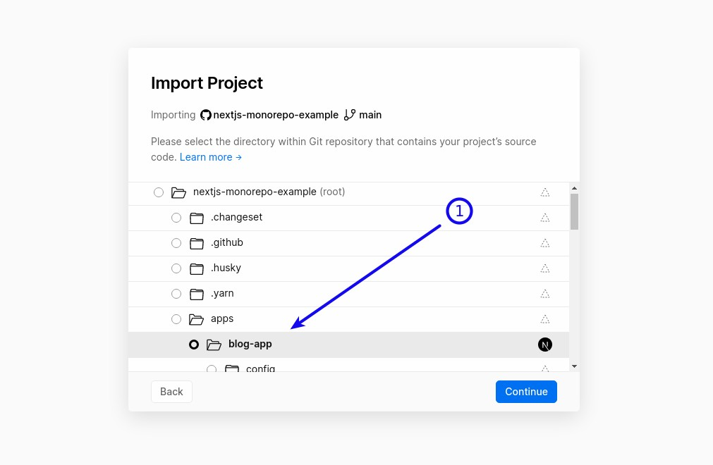
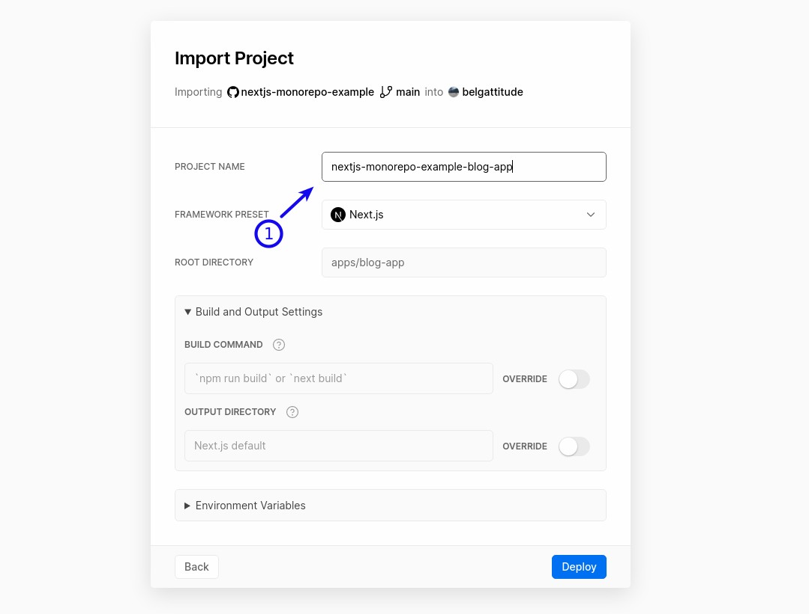
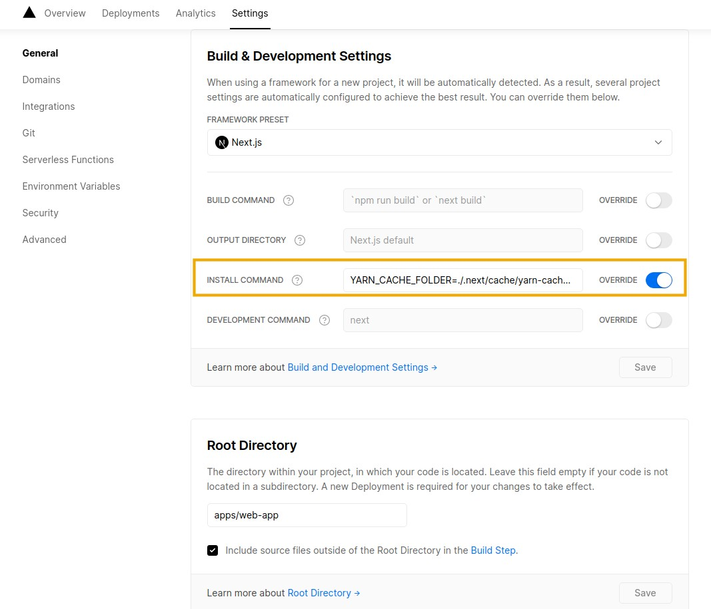

# Vercel

## How to deploy a monorepo on Vercel ?

Vercel supports it natively, so there's pretty much nothing to do.

### Install command

On vercel, override the **Install command** with:

```
yarn install --immutable --inline-builds
```

> _Tip_: 'immutable' to respect the yarn.lock file, 'inline-builds' to display errors during the
> link step (rather than saving into /tmp/xfs... log file)

**Adventurous users:** it's possible to speed up the install process by playing with
those environment variables:

| Env                                                | Description                                                    |
| -------------------------------------------------- | -------------------------------------------------------------- |
| `YARN_CACHE_FOLDER=../../node_modules/.cache/yarn` | Store yarn cache into a vercel one to speed up install         |
| `YARN_CACHE_FOLDER=./.next/cache/yarn`             | Store yarn cache in a vercel one for nextjs apps               |
| `PRISMA_SKIP_POSTINSTALL_GENERATE=true`            | Do not run prisma generate (handled in nextjs-app postinstall) |
| `HUSKY=0`                                          | Prevent husky to install hooks                                 |

> ie `YARN_CACHE_FOLDER=../../node_modules/.cache/yarn PRISMA_SKIP_POSTINSTALL_GENERATE=true PLAYWRIGHT_SKIP_BROWSER_DOWNLOAD=1 HUSKY=0 yarn install --immutable`

### How to from the vercel ui

1. Select the app
   
2. Choose the name
   

3. (Option) To speed up install step and allow yarn 2 cache strategy till it's supported natively
   by Vercel, use a workaround by overriding install step with `YARN_CACHE_FOLDER=./.next/cache/yarn-cache yarn install`.

   
